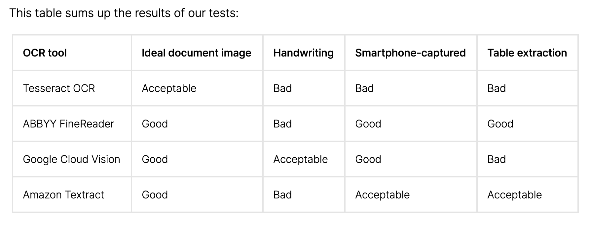
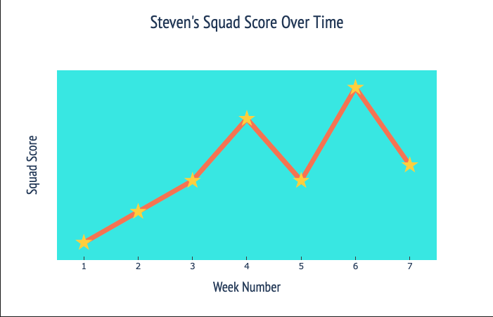
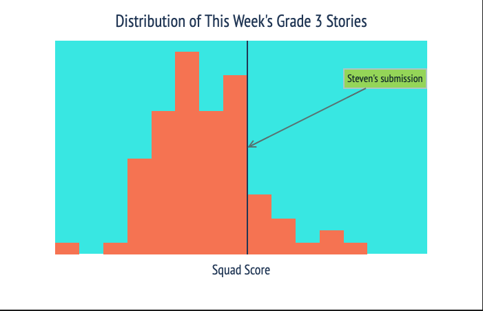
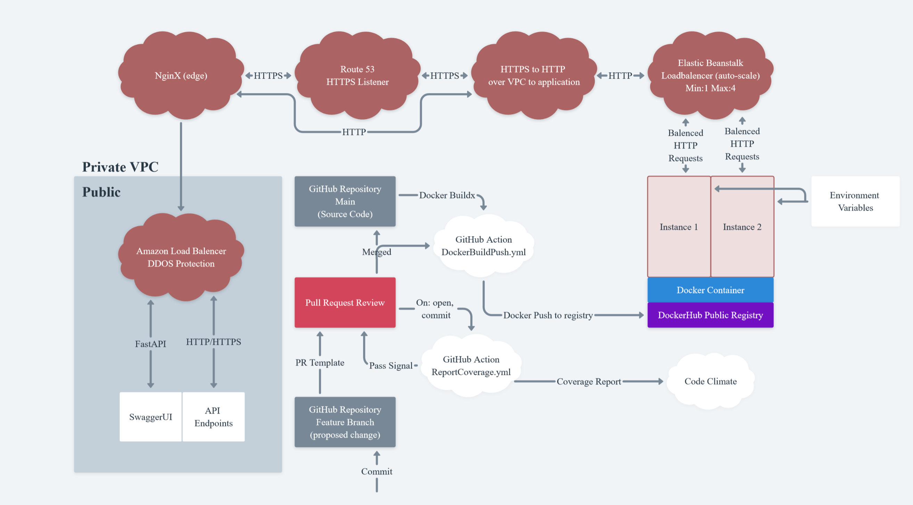
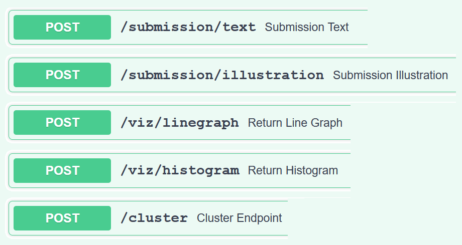
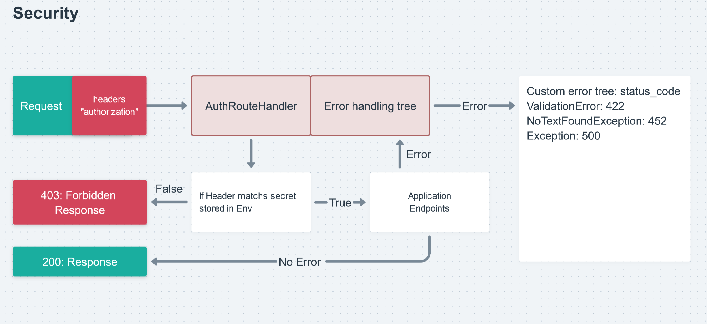

## Story Squad, Team B - Data Science

# What is Story Squad?
[Story Squad](https://www.storysquad.education/) is the dream of a former teacher, Graig Peterson, to create opportunities for children to have creative writing and drawing time off-screen. Here's how it works: child users of the website are provided a new chapter in an ongoing story each weekend. They read the story, and then follow both a writing and drawing prompt to spend an hour off-screen writing and drawing. When they're done, they upload photos of each, and this is where our data science team comes in. The stories are transcribed into text, analyzed for complexity, screened for inappropriate content, and then sent to a moderator. Once all submissions have been checked over on moderation day, our clustering algorithm groups the submissions by similar complexity and creates Squads of 4 to head into a game of assigning points and voting for the best submissions in head-to-head pairings within the cluster! Then it starts all over again the following weekend.

**Want to hear an overview of all our project features?** Click the Story Squad banner above for a link to our product video! Or keep scrolling to read more thorough information on each feature.

# Scope
We worked with a cross-functional team of 5 Web Developers, 3 Data Scientists, and 1 Technical Product Lead. We had 8 weeks to build as much of Story Squad as we could. We referenced a previous team's code body who began work on the project, but mostly we treated it like a greenfield project. We were one of 3 teams working on this same project, who each organically focused on a slightly different piece of the product. Our goal was to get the web application fully functional as far as transcription and complexity analysis, and then any aspects of the clustering and competition (or gamification) were stretch goals, which in the end we successfully implemented most features of.

Our entire implementation was built to be in compliance with the [Children's Online Privacy Protection Act](https://www.ecfr.gov/cgi-bin/text-idx?SID=4939e77c77a1a1a08c1cbf905fc4b409&node=16%3A1.0.1.3.36&rgn=div5) (COPPA).

See links below for our deployed sites and our team's corresponding web development repos. Please note that our website and API were hosted on AWS accounts owned by Lambda School, which are likely to be discontinued at the close of our project, therefore breaking two of the links below.

- Link to [deployed application](https://b.storysquad.dev/)
- Link to deployed [Data Science API & documentation](http://labs26-story-squad-teamb.eba-ampzurak.us-east-1.elasticbeanstalk.com/)
- Link to our team's [Frontend Repo](https://github.com/Lambda-School-Labs/Labs26-StorySquad-FE-TeamB)
- Link to our team's [Backend Repo](https://github.com/Lambda-School-Labs/Labs26-StorySquad-BE-TeamB)

Given that this project will have future teams of data scientists building off of our codebase, this README also serves as a transition document.

# Features

## Transcription and Moderation
### **Transcription**
- Functionality
   - Connects to Google Cloud Vision API (GCV) to perform transcription of the user uploaded written story. Utilizes the `document_text_detection` method as that is best for Handwritten Text Recognition. Currently being hosted using Google credentials belonging to one of the team members - a new DS team would need to set up their own credentials. It is free to sign up and they provide $300 in free credit. During our time working on this project, we didn’t accrue any charges. While we found using our own credentials sufficient for our purposes, the stakeholders do have Google credentials that they are willing to provide if you prefer.
- Process
   - Although we were tempted, as were past teams, to build an OCR by hand, we ultimately decided against it because we did not have a large enough dataset to train an OCR model on. The stakeholders also supported the use of a paid platform and we chose GCV because it produced the best results out of the models we researched.
   
- Future Considerations
   - While GCV was the best model we had access to, we still came across an issue of transcription errors. These errors are crucial to understand as they affected our ability to extract meaningful and reliable complexity metrics. Improving the transcription would improve the complexity metrics which in turn would improve the visualizations on the parent dashboard and our clustering algorithm. We found that the images with the worst handwriting typically had the most transcription errors. In lieu of the students improving their handwriting, the best place to improve transcription accuracy would be by improving the quality of the images by utilizing pre-processing techniques. A good [article](https://towardsdatascience.com/pre-processing-in-ocr-fc231c6035a7) for exploring pre-processing images.
   - Another team working on Story Squad at the same time as us spent a lot of time working on training their own OCR with Tesseract. Their use of pre-processing seemed very effective. Explore their [notebook](https://github.com/Lambda-School-Labs/Labs26-StorySquad-DS-TeamC/blob/main/notebooks/UGC_Preprocessing_Exploration.ipynb).
   - Spell checking was explored to improve the output of the transcription. Currently, it is not implemented as the transcription errors were too high to overcome with a spell checker. If the transcription accuracy can be improved, this could be implemented. The `count_spelling_errors` [notebook](notebooks/count_spelling_errors.ipynb) contains the exploration of two different spell check methods. A third team working on Story Sqaud implemented a spell checker [here](https://github.com/Lambda-School-Labs/Labs26-StorySquad-DS-TeamA/blob/main/project/app/ocr/text_complexity.py).
- Links
   - The `transcribed_stories` [notebook](notebooks/transcribed_stories.ipynb) creates a CSV with all of the transcriptions from the stories provided by the stakeholders.
   - The `google_api.py` [script](project/app/utils/img_processing/google_api.py) builds the class that the application utilizes to connect to GCV API.
   - The calculation of the error metric was leveraged from a prior DS team’s [notebook](https://github.com/Lambda-School-Labs/story-squad-ds/blob/master/Notebooks/addingmetrics.ipynb).

### **Safe Search**
- Functionality
   - Utilizes the SafeSearch method provided by Google Cloud Vision, which screens user-uploaded drawings for inappropriate content. Google will return the likelihood of the image being ‘adult’, ‘racy’, or ‘violent’. A flag will be raised and returned to the administration dashboard if Google returns a probability of ‘Possible’ or above for any of these categories.
- Process
   - This functionality was not actually requested by the stakeholders. Under COPPA regulation, every illustration that is uploaded by the students is required to have human moderation to prevent inappropriate material being displayed to the other students.
   - We decided to include the SafeSearch functionality because it was a simple implementation that would help the moderators prioritize their work.
   - On that same note, we decided to have a lower threshold to ensure that our recall rate was optimized. As the SafeSearch flags will be confirmed by human eyes we felt that it was better to flag too many submissions than potentially miss inappropriate images.
- Future Considerations
   - Through our testing, this system seems to work very well. If future teams decide the SafeSearch is too sensitive or not sensitive enough, the threshold can be adjusted.
- Links
   - The `safe_search.py` [script](project/app/utils/img_processing/safe_search.py) is the function used in the application to perform the SafeSearch.

### **Low Confidence Flag**
- Functionality
   - This feature raises a flag if the Google Cloud Vision API is less than 85% confident about its transcription. The logic is that a low confidence transcription will result in higher transcription errors. High transcription errors will, in turn, produce an unreliable evaluation metric for that submission. By monitoring this confidence level, we hope to return a disclaimer to the user that the evaluation metric may not be accurate and tips to improve image and handwriting quality to improve our transcription. While the framework for this feature is completed on the data science end, it is not a feature that the web team has implemented on their side yet. Currently, the threshold is set fairly low which will serve to catch the submissions that are likely to be severely impacted by poor translation.
- Process
   - We were given 167 images of stories as well as their human transcriptions by the stakeholders. We used these human transcriptions alongside the transcriptions created with Google Cloud Vision to calculate the error rate of the GCV transcription. The hope was that the error rate and confidence level were directly correlated. Unfortunately, the highest correlation we saw was 0.49.
- Future Considerations
   - Future improvements on transcription quality, such as implementing pre-processing, may improve the correlation between the error metric and the confidence level. Additionally, different methods of calculating the error may result in higher correlation. A higher correlation would allow us to select a more discerning threshold that will flag submissions that are being negatively affected by poor transcription. A deeper discussion on discovering errors in the human transcriptions, with the missing pages identified, can be found in the `transcription_confidence` [notebook](notebooks/transcription_confidence.ipynb).
   - As mentioned above, this feature has not been implemented on the web team’s end yet.
- Links
   - The notebook exploring the transcription confidence levels can be found in `transcription_confidence` [notebook](notebooks/transcription_confidence.ipynb). The correlation matrix and scatter plot exploring the relationship between the confidence level and error metric can be found in this notebook. Additionally, this notebook creates a CSV with the API transcriptions, human transcriptions, calculated error between the two and Google API confidence level for each submission.
   - The `confidence_flag.py` [file](project/app/utils/img_processing/confidence_flag.py) contains the script that the application uses to implement this feature.
### **Inappropriate Content Flagging**
- Functionality
    - This feature serves to moderate the written submissions that the student's upload. Each word in the transcribed text is referenced against a dictionary of inappropriate words ([bad_single.csv](project/app/utils/moderation/bad_single.csv)).
    - If inappropriate words are detected, a flag is raised and passed to an administrator for further evaluation.
- Process
   - This was the only feature that we pulled directly from [the previous team's DS work](https://github.com/Lambda-School-Labs/story-squad-ds) without additional iteration. It was requested by the stakeholder.
- Future Considerations
    - Ideally this feature would utilize NLP techniques to evaluate sentiment analysis for better moderation.

### **Sensitive Content Flagging**
- Functionality
   - This feature is not currently functional, but there is the framework of a function in place in [`text_moderation.py`](project/app/utils/moderation/text_moderation.py) to be able to add the sensitive content flag in addition to the inappropriate content flag, to flag both for the moderator. The current implementation will just always return a `False` flag for `SensitiveContent`.
- Process
   - This feature is not fully functional, because the idea came up too late in the project. The idea was prompted by a story (ID 5114) that alluded to an abusive mother. We realized that we may need to have additional screening for sensitive content that could even necessitate some kind of proactive action/intervention by Story Squad staff. We brought this to the stakeholders, and they said that while Story Squad will not be a [legally mandated reporter](https://www.socialworkdegreeguide.com/faq/what-is-a-mandated-reporter/), they want to try to do the right thing, and keep this potential in mind.
   - Ultimately, we only got a very bare bones implementation ready to go to screen for sensitive content (including potential abuse or suicide/self-harm), but the stakeholder requested we simply document our progress, and allow for a future team to create a more thorough solution. See [this Google Doc](https://docs.google.com/document/d/1HusCK9FqadwIFyfAwQVN03bq2LCqujxZX0QwZCLA7do/edit?usp=sharing) for a write-up of our MVP implementation idea and general considerations.
- Future Considerations
   - Ideally, this type of content moderation would be done through a pre-trained model that could generate a flag based on context and natural language understanding, rather than simply a dictionary check of potentially indicative words. Of course, this is difficult due to the limitations of our use-case: small amount of training data, errors in children’s spelling, and errors in transcription. But the importance of this feature, both for moderating what content is put in front of other children, and for noticing if a child might be in unsafe circumstances, necessitates this type of feature exploration.

## Complexity Analysis
### **Complexity Metric**
- Functionality
   - We named our complexity metric the "Squad Score". The functionality of each Squad Score version is fully documented in the Release notes of both [v1.0](https://github.com/Lambda-School-Labs/Labs26-StorySquad-DS-TeamB/releases/tag/v1.0) and [v1.1](https://github.com/Lambda-School-Labs/Labs26-StorySquad-DS-TeamB/releases/tag/v1.1).
   - Essentially, the Squad Score feature generates a complexity metric for each story transcription, that is used both for visualizations on the parent dashboard to show student progress, and used to cluster child users for the gamification component.
   - Formula: story_length(1)(30) + avg_word_len(1)(30) + quotes_number(1)(30) + unique_words(1)(30) + adj_num(1)(30)
   - See Release notes for further information on the formula, including the features, initialized weights, and metrics.
- Process / Reasoning
   - Check out [this Medium article](https://medium.com/@lori.schlatter/simplicity-of-complexity-the-realities-of-data-science-decision-making-af0ef737a5bf) for more thorough detail on the process of developing this metric.
   - Coming into the project, we assumed we would be using some kind of advanced NLP techniques for this text analysis. Then the stakeholder’s initial guidance on a complexity metric was for it to resemble a [Lexile score](https://www.lexialearning.com/blog/more-number-what-is-lexile-measure), which we quickly realized was a proprietary metric that we wouldn’t be able to replicate. We did find a [free Lexile analyzer](https://la-tools.lexile.com/help/), but it specifically indicated that student writing was not a good candidate for use as input. We then looked into the Python [`textstat`](https://pypi.org/project/textstat/) package and explored the origins of all of those metrics (see [this doc](https://docs.google.com/document/d/1e-LcyRn0DHQJa9pueNpCjKAYj-dyjI3fDtynhTrlGy4/edit?usp=sharing) for that writeup). Ultimately, however, we came to a similar conclusion that the previous team did -- that these metrics are all trained on professionally edited and proofread text, and did not have a guarantee of generalizing to unedited, un-proofread, error-prone transcriptions of children’s writing.
   - We wanted to generate a metric that would be as minimally impacted in its consistency by inevitable errors we knew would come up in our transcribed text, but also would have a high likelihood of being generalizable to new data. Therefore, we opted to build our own simple metric for our MVP that would only use features that we could justify based either on features that:
      - showed up in other validated complexity metrics (such as word length)
      - or
      - were specifically requested by our stakeholder (such as quotes number)
      - and
      - that were implemented in ways that minimized error (such as using word length by character rather than syllable, or number of quotes rather than aiming for a percentage-of-dialogue feature, or number of unique words rather than a comparison to a set list of complex words).
   - See the [`squad_score_mvp` notebook](notebooks/squad_score_mvp.ipynb) for creation of the Squad Score and exploration of some additional features, and see the [previous team's notebook](https://github.com/Lambda-School-Labs/story-squad-ds/blob/master/Notebooks/addingmetrics.ipynb) that includes error exploration of quote count difference between the computer-generated and human-generated transcriptions.
   - v1.0 utilized only the metrics that could be generated with Python alone, and then v1.1 implemented `nltk` with the number of adjectives feature.
   - Given that we did not have a labeled dataset, we opted to not fine-tune any of the weights for the features, as there was no way to test this kind of customization. See [this doc](https://docs.google.com/document/d/1JfJY4qY-1BGgdbpDrtCxG0Vz8SHXcCAHQLBAlZunxm0/edit?usp=sharing) transcribing a conversation with the stakeholder about potential solutions to this problem. After this conversation, our stakeholder provided us with a small set of labels midway through the project, of 25 stories that were hand-ranked by a third party (see `rankings.csv` in [`data`](data/) folder). We did use this ranking to generate our metric for our formula in terms of correlation, but did not use it to generate weights since it was such a small, and potentially subjective list of labels.
- Future Considerations
   - It’s worth additional conversation with the stakeholder about whether or not labels can ever be generated on the existing and incoming data. This would provide the best way to provide a little more confidence about adding weights or more experimental features. In lieu of this, the stakeholders were clear that they still value exploration of this metric, as long as it is heavily documented and versioned (we used GitHub releases for our versioning) so that any iteration can easily be pulled up. Note that if at any time labels are added, the stakeholders were also clear that the labels would need to be treated as imperfect, since it’s nearly impossible to have totally objective metrics for this writing.
   - If new data is provided in the future, the MinMaxScaler in the [`squad_score_mvp` notebook](notebooks/squad_score_mvp.ipynb) will need to be retrained with the entire corpus, and re-pickled and deployed.

### **Visualizations**
- Functionality
   - Creates two visualizations for the parent dashboard. This will allow the parents to keep an eye on the progress of their student. The final visuals are a result of discussions with the stakeholders. One visual is a histogram that plots the distribution of all of that week’s scores for the student’s specific grade. The student’s score for that week is plotted as a vertical line to be able to see how they compare to the other submissions for that week. The second visual is a line graph that charts the history of the student’s submissions. At least one submission must be made for the parents to be able to view these visuals. Additionally, scores will not be available to display until the submissions have successfully gone through the moderation process at which point they will be released by the web back-end.
- Process
   - This is a new feature idea that was the result of a lot of back and forth discussion between the stakeholders and our DS team member Lori. The stakeholders were very supportive of this idea but very specific in its implementation. They want to provide visibility so that the parents can be engaged in their student's progress, but they do not want to display any metrics to either the student or parent user. They feel this would take away from the creative safe-space they are trying to cultivate for the students.
   - This [Google Doc](https://docs.google.com/document/d/1VZZFP49LhYGMO5QV2quwKQsNbxUSRlIXdT3vI9jmJgY/edit) was sent to the stakeholders and outlines our thought process and includes mockups of various visualizations.
   - The stakeholders requested a working model by the end of our time working on this project (10/23/20) so they could test it in front of a panel of parent users for feedback.
- Future Considerations
   - For a future iteration, we had an idea that the stakeholders were very excited about. Our idea is to populate a dynamic sentence at the bottom of the line graph that highlights an area that the student improved in for that week. By keeping track of the metrics for each of the student’s submissions, we can highlight improvements against either their average performance or their last submission. Again we would want to do this at a high level without disclosing specific numbers. The idea is to always be able to highlight something positive about the student’s writing that week. For example: “It looks like Bobby used more description adjectives than average this week!” or “Bobby increased his use of dialogue this week compared to last week!”
   - Again, the stakeholders will be testing this new feature in front of parent users at some point and will have feedback on what to change, keep or may decide against the feature altogether.
- Links
   - The `score_visual` [notebook](notebooks/score_visual.ipynb) explores various visuals that we presented to the stakeholders. The `histogram.py` [file](project/app/utils/visualizations/histogram.py) and the `line_graph.py` [file](project/app/utils/visualizations/line_graph.py) include the scripts for the final approved visualizations. They produce a JSON file for the web to display on the parent dashboard.

### **Gamification / Clustering**
- Functionality
   - The current clustering function we have implemented is a basic MVP for clustering, which sorts moderator-accepted submissions for each cohort (meaning the group of users that is on a given chapter of the story) by Squad Score, and returns clusters of 4 by submission ID to the web backend to be randomly paired.
   - For cohorts with submission counts not divisible by 4, some submission IDs are duplicated (that are still close in Squad Score) to ensure that only clusters of 4 are returned. This is coded such that, if at all possible, no cluster will have more than 1 submission ID that is also found in another cluster.
   - If there are under 4 submissions in a cohort, a message is returned instead, that there are not enough submissions to form a cluster.
- Process
   - We did not end up implementing a DS database, meaning that unless we requested the web backend to store story transcriptions (which could be an option for a future iteration), we would need to re-transcribe stories after they were moderated each week in order to generate a more sophisticated clustering algorithm based on features. As it is, without either of these things in place, the best way to cluster was simply by ordered Squad Score. However, other potential clustering algorithms were explored in the [clustering notebook](notebooks/clustering.ipynb).
   - One big issue that has yet to have a fully engineered solution is the “remainder problem”, which is essentially that the gamification framework requires there to be 4 players per cluster, but of course there will not always be a number of submissions divisible by 4. Our idea for a solution is to duplicate submissions (as mentioned above), meaning we’d pull in another story submitted that week with a similar Squad Score, but without being attached to an actual user. This way, the others in the cluster can still view 4 stories, but then have a default code script in place that will auto-vote and assign points on behalf of the duplicated submissions, essentially having a “bot” as part of the team (and thus, we want to ensure no more than 1 bot per cluster). However, this structure that would generate the “bot” auto-play is not yet in place on our web backend, so the remainder problem isn’t fully solved in our deployed implementation.
- Future Considerations
   - Of course, a more sophisticated clustering algorithm would be preferred. In order to avoid re-transcribing stories (which would take a lot of extra time, and would add to the Google Cloud bill), either the web database could store transcriptions after initial submission, or DS could generate its own database. Note that if DS creates its own database, it needs to have the same considerations that Web’s does: i.e. how to handle stories that are moderated out of gamification, etc.

## Deployment
### **Infrastructure**
The infrastructure is handled by AWS Elastic Beanstalk Service using Docker containers built and pushed to the registry by GitHub actions. This has allowed us to
automate a decent part of the deployment cycle.

### **Diagram**

These links were important to learn where to start with `AWS`:
- [The Official labs guide for DS](https://docs.labs.lambdaschool.com/data-science/)
- [A guide to setting up HTTPS on Route 53 (may require APL)](https://docs.labs.lambdaschool.com/guides/aws/elastic-beanstalk/elastic-beanstalk-dns)
- [AWS EBS Dashboard](https://console.aws.amazon.com/elasticbeanstalk/home?region=us-east-1#/environments)

### **API Endpoints**

- Submission subroute:
   - This subroute deals with original copy uploads of the user generated content (UGC).

   - URLs in these endpoints are verified via a SHA512 checksum that accompanies the file. These hashes are used to add an extra layer of protection to make sure that the file that is passed to the web backend and uploaded to the S3 bucket is indeed the file that we are grading.

   - In the `/text` endpoint, the transcription service and `squad_score` method are used to transcribe, flag, and score submissions,

   - A particular note about the `/cluster` endpoint. Because of the limitations with Pydantic data modeling package, we could not structure a proper request body model.
   Our request body was structured with cohort IDs as the dictionary keys, then nested dictionaries inside each contained submissionIDs as keys. Given that the cluster endpoint was a late implementation into the project, we were bound by these limitations and therefore built a model around the existing request body. in future iterations **we would HIGHLY RECOMMEND changing the request body of this endpoint** so that a proper Pydantic model can be used to build out the SwaggerUI example request body.

### **GitHub Actions**

- Functionality:
   - `.github/workflows/ReportCoverage.yml` - Runs on: commits to an open pull request to the main branch.
   Reports test coverage to Code Climate using a series of run commands to capture test coverage.
   - `.github/workflows/DockerBuildPush.yml` - Runs on: merge into main branch.
   Builds and pushes a Docker image to the public DockerHub registry.
   This action uses the GitHub cache to store layers of the docker image to increase the speed of the build action.

   - Use of these actions help automate the process of deploying a new Docker image to the production server. Our main motivation for making these features was to increase the code quality in the codebase and to eliminate one of the more repetitive tasks of building the Docker image and pushing it to the registry on each merge.

- Known Problems:
   - The coverage action doesn't actually upload the coverage data to Code Climate. We couldn't find any documentation on using `Coverage.py` with GitHub Actions as the CI/CD provider. Our approach was to curl the uploader program and execute it with local reports file.

- Future Suggestions:
   - TravisCI would be a better CI/CD provider. The Code Climate uploader is supported by TravisCI natively.
   - Formatting bot that would format to Black before merge to `main` to ensure PEP compliance.
   - Converting the existing actions into Docker Containers that can be hosted as a community asset for other projects to leverage. Converting the coverage report to a Docker image may also fix the reports not being uploaded.
   - Working with the artifacts action to export the coverage reports and Docker image layer cache on tag bump.
   - There should also be an action that is developed to increment the release version of the application.

### **Security**

- Functionality
   - Currently there is an APIRoute class that can plug into the application router for different endpoints. This function takes all incoming requests and separates the authorization header from the request client to check if that client is authorized to use the API endpoints.

- Process
   - Initially this functionality was going to get handled by the [FastAPI.middleware decorator](https://fastapi.tiangolo.com/tutorial/middleware/) to declare a custom function as middleware which is supposed to have the exact same functionality as the class that we implemented. However, during testing it was clear that the middleware function was ineffective. The function has a limited scope that it can work with, which for FastAPI that is restricted to HTTP requests made from a web browser. When hitting the endpoints from an unauthorized client through Python, the middleware function would not trigger and check the request client header. To get around this limited functionality of the built-in middleware, we customized the service that the middleware uses to receive its hook. The documentation for doing so can be found on the [FastAPI Documentation here](https://fastapi.tiangolo.com/advanced/custom-request-and-route/)
- Future Considerations
   - This method is clearly a bit of a workaround. In future iterations, this class could be completely reworked into a framework for adding custom middleware solutions that are not restricted to HTTP network traffic.
   - In our application, the value of `DS_SECRET_TOKEN` is static. In future iterations this should be given routes to regenerate new tokens and deprecate compromised or old tokens. Adding this functionality would increase the security of the tokens and decrease the attack vectors that could be exploited in a production server.

# Meet the Team
Feel free to reach out to anyone on the team with any questions about the project!

| [Steven Chase](https://github.com/schase15) | [Lori Schlatter](https://github.com/lorischl-otter) | [Joseph Wilson](https://github.com/Jwilson1172) |
| :-----------------------------------------: | :-------------------------------------------------: | :---------------------------------------------: |
|  |  |  |
|  |  |  |
|  |  |  |
