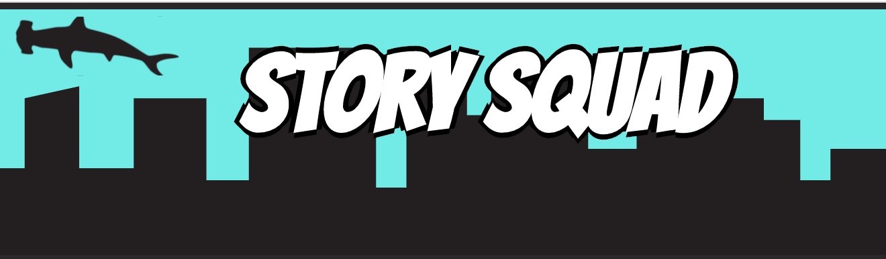

## Story Squad, Team B - Data Science

We're working to build the Data Science backend for [Story Squad](https://www.storysquad.education/), which involves transcribing children's stories, using a custom metric to analyze complexity, and clustering teams of 4 child users based on their stories each week.

See [Release Version 1.0 Notes](https://github.com/Lambda-School-Labs/Labs26-StorySquad-DS-TeamB/releases/tag/v1.0) for documentation of currently implemented features. Full README documentation will be in place by 10/23/2020, along with a 2.0 release.