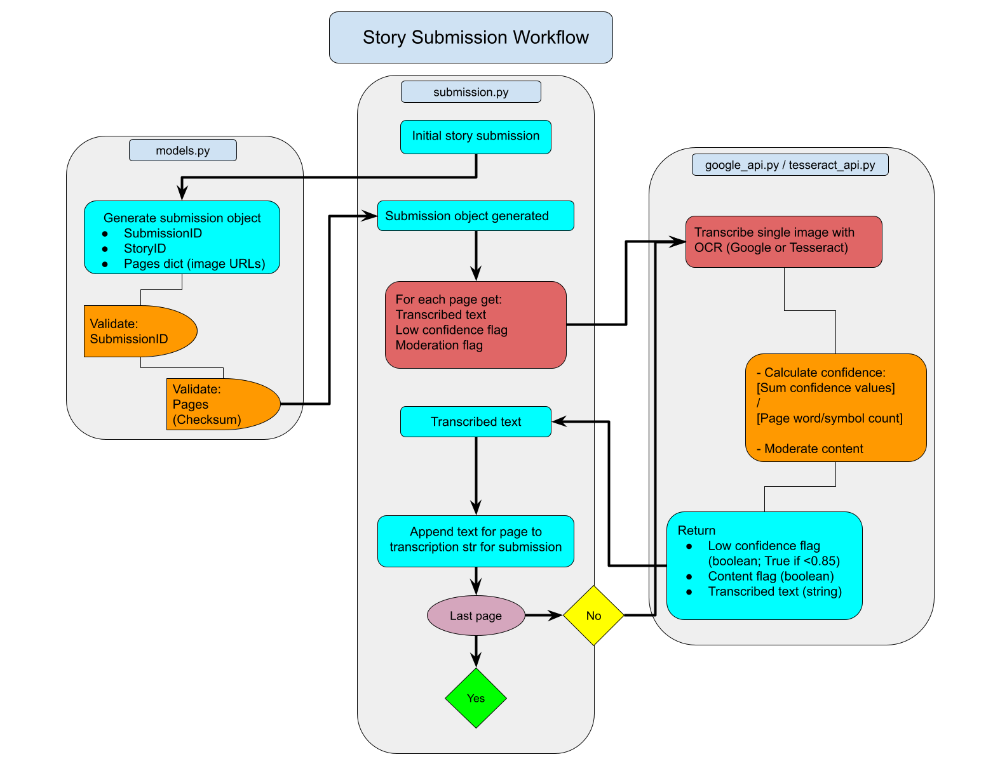

# A RESTful API for the Story Squad Project

This API can be used to perform the following data analysis tasks. 

## Submission 

### Story:
Takes story submission, calls OCR model (Google or Tesseract) to: 
* Transcribe the text from the story images
* Moderate the text for content
* Calculate a confidence score for the transcription
* Use the text to calculate the SquadScore

### Drawings:
* Uses Google Vision SafeSearch API to flag explicit content in the drawings

## Visualization
Takes user data to produce:
* Line graph of a student's SquadScore history
* Histogram of a grade's SquadScore distribution, with a vertical line for the student's most recent score
* Crop cloud of the student's progression in handwritting 

## Clustering
Takes list of cohort and submission objects, returns clusters based on cohort in groups of 4

----------------------

## Story submission data flow

Story submissions are sent from the web team as a **Submission Object**, which is defined in `api/models.py`. Each Submission Object contains:
* A unique Submission ID
* The story ID (for the story the submission is based on, not the story the student wrote)
* Dictionary of image pages (URLs, checksums)
* OCR model (currently defaults to Google Vision, enter "tesseract" in lower case to use Tesseract)

Each page in the Submission Object is sent by `api/submission.py` to the OCR API, which returns the following endpoints:
* Transcribed text for the page (string)
* Confidence in the transcription (boolean: True = low confiende)
* Moderation flag (boolean: True = flagged for content)

The above is performed by `utils/img_processing/google_api.py` or `utils/img_processing/tesseract_api.py` depending on which OCR was selected.

These endpoints are then used by `api/submission.py` to calculate the SquadScore and word count. Finally, it returns a JSON response containing the following:
* The Submission ID
* Content moderation flag
* Low confidence flag
* Complexity (SquadScore)
* Word count

-----------
### Functionality notes:
* Make sure to have the correct environmental variables. These include `DS_SECRET_TOKEN` and `GOOGLE_CREDS`. `DS_SECRET_TOKEN` may need to be entered manually in the API.
* Windows users should add the Tesseract path in tesseract_api.py (see comment in file).
* Local environment variables can be used to substitute a different Tesseract model (see `api/submission.py`).  
